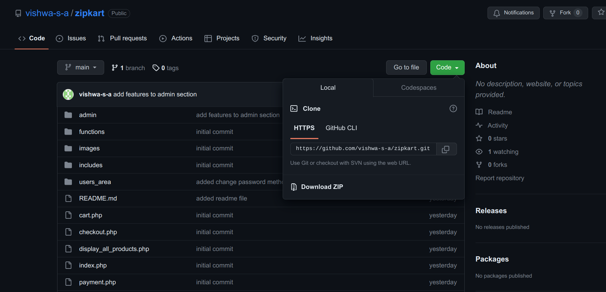

# zipkart-Buy happiness

### <mark>A Dynamic E-commerce Full-stack Website </mark>
### You can checkout the website associated with this repository by clicking this link [zipkart-v1](https://zipkart-v-1.000webhostapp.com/)

### You might get a message stating this website is deceptive but don't worry, click on <mark>'Details'</mark> button which is at the bottom of the page, then click <mark>'visit this unsafe site'</mark> which will be found at the bottom of next page or current page

## <mark>Warning</mark> 
Don't enter any of your real personal details when checking out this website

### Technologies used for making this website
* html, css, javascript
* bootstrap
* mysql for database
* php for back-end development

### Website is easy to navigate and user friendly.

### It has the following features for Users:
* User Registration
* User login system
* Change password
* Profile management system
* Shopping cart 
* Order history 

### Following features for Admin:
* Product management
* Order management system
* User management
* Category management
* Brand management
* Payment management

### To use this project locally, download this repository as a zip file by clicking on code button or clone the repository

#### Before running this project you need to access <mark>phpMyAdmin</mark> panel and create a new Database named as <mark>zipkart</mark> and import the given <mark>"zipkart.sql"</mark> file there, so our Database gets ready to serve our backend

#### This project directory should have all the necessary permissions for the user or group, same as the user/group in which the apache server operates otherwise the file insert or delete operations will fail especially for the images which will be uploaded by the admin/user

### Admin panel is accessed by typing the following link in browser
> http://localhost/..path_to_root_directory../admin
### To access the admin panel use the following credentials for admin login
> email: admin@gmail.com  
> password: admin

### Thank you for reading 